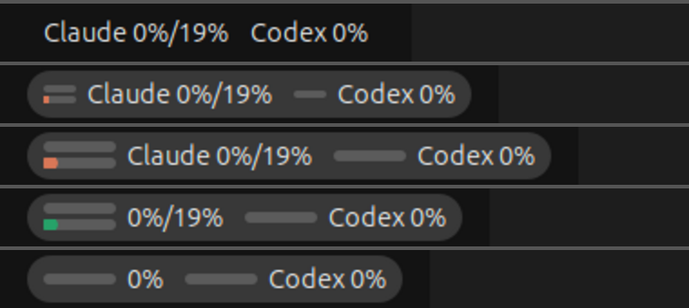

# AI Usage Tracker

A GNOME Shell extension that shows how much of your **Claude Code** and
**Codex** plan limits you have used, right in the top bar.


Top bar, from top to bottom: default, Show Bars, longer and thicker bars,
Claude with a custom colour and its name hidden, 5-hour limits only (Codex
falls back to its weekly limit because its plan has no 5-hour limit):



- Top bar shows the 5-hour and weekly usage of each service, e.g.
  `Claude 19%/18%  Codex 0%`
- The menu shows every limit window (5-hour, weekly) with a bar and the time
  it resets. Bars use the service colour (Claude orange and Codex blue by
  default) and turn yellow at 70% and red at 90% used
- Settings, in three tabs:
  - **Services**, for each service: show it in the top bar and menu, top bar
    only, menu only, or disable it; show usage (bars fill up) or what is
    remaining (bars empty); refresh interval (Claude 5 to 120 minutes, Codex
    1 to 120, default 10)
  - **Appearance**: what the top bar shows (service names, usage text, small
    bars with one per limit and the 5-hour limit on top), the bar length and
    thickness, whether to always show the app icon (a gauge from your icon
    theme, which also appears when nothing else is shown), and for each
    service the limits shown in the top bar (5-hour, weekly or both) and its
    colour
  - **About**: version, changelog and links

Supports GNOME Shell 46 – 50.

## Requirements

You need to be signed in with a subscription in the command line tools:

| Service     | Sign in with                 | File the extension reads       |
| ----------- | ---------------------------- | ------------------------------ |
| Claude Code | `claude` → `/login`          | `~/.claude/.credentials.json`  |
| Codex       | `codex login` (with ChatGPT) | `~/.codex/auth.json`           |

`CLAUDE_CONFIG_DIR` and `CODEX_HOME` are respected if they are set in the
environment of GNOME Shell.

API key logins have no plan limits, so there is nothing to show for them.

## Installation

### From extensions.gnome.org

Not available. I have decided not to upload this extension to
[extensions.gnome.org](https://extensions.gnome.org). Its
[review guidelines](https://gjs.guide/extensions/review-guidelines/review-guidelines.html)
say:

> Extensions must not be AI-generated. While it is **not** prohibited to use
> AI as a learning aid or a development tool (i.e. code completions),
> extension developers should be able to justify and explain the code they
> submit, within reason.

Most of this extension was written by an AI coding assistant (see
[AI Disclosure](#ai-disclosure)), so it does not belong there. It is only
distributed from this repository.

### From GitHub releases

Download the latest release and install it:

```sh
wget https://github.com/salihmarangoz/gnome-ai-usage-tracker/releases/latest/download/ai-usage-tracker@salihmarangoz.github.io.shell-extension.zip
gnome-extensions install --force ai-usage-tracker@salihmarangoz.github.io.shell-extension.zip
```

To update, run the same two commands again. All versions are on the
[releases page](https://github.com/salihmarangoz/gnome-ai-usage-tracker/releases).

### From source

Needs Node.js and npm (the extension is written in TypeScript).

```sh
git clone https://github.com/salihmarangoz/gnome-ai-usage-tracker.git
cd gnome-ai-usage-tracker
make install
```

### Enable it

Restart GNOME Shell (on X11 press <kbd>Alt</kbd>+<kbd>F2</kbd>, type `r`,
press <kbd>Enter</kbd>; on Wayland log out and back in) and enable the
extension:

```sh
gnome-extensions enable ai-usage-tracker@salihmarangoz.github.io
```

## Privacy

- The extension reads the OAuth access token that the CLI already stored on
  your computer and sends it **only** to the service that issued it:
  `api.anthropic.com` for Claude Code and `chatgpt.com` for Codex.
- Tokens are never written, refreshed or stored anywhere else. If a token has
  expired, run the CLI once and it will refresh it.
- No other network requests, no telemetry.

To report a security problem, see [SECURITY.md](SECURITY.md).

The usage endpoints are the ones the official apps use. They are not a public
API and may change without notice, which would break the extension until it is
updated.

## Troubleshooting

| Message in the menu      | What to do                                              |
| ------------------------ | ------------------------------------------------------- |
| Not signed in            | Sign in with the CLI (see Requirements)                 |
| Login expired, run the CLI once to refresh it | Start `claude` or `codex` once         |
| Too many requests, try again in a few minutes | Claude throttles this endpoint; wait or raise the refresh interval |
| Request failed (HTTP …)  | The service is down or changed its API; try again later |

Logs: `journalctl -f -o cat /usr/bin/gnome-shell`

## Development

See [docs/DEVELOPMENT.md](docs/DEVELOPMENT.md). Changes are listed in
[CHANGELOG.md](CHANGELOG.md).

## AI Disclosure

This extension was written with substantial help from an AI coding assistant.
[Claude Code](https://claude.com/claude-code) (Anthropic, model Claude Opus 5.5)
generated most of the code, the documentation and this README from the
maintainer's instructions. The maintainer reviews and tests every change.
Because the code is mostly AI-generated, the extension is not published on
extensions.gnome.org (see [Installation](#installation)).

## Disclaimer

This extension is provided as is, without any warranty (see the
[MIT License](LICENSE)). I am not responsible for any data loss, account
problems or security issues caused by using it. Use it at your own risk.

## License

[MIT](LICENSE)

Claude and Claude Code are trademarks of Anthropic. Codex and ChatGPT are
trademarks of OpenAI. This project is not affiliated with or endorsed by
either company.
